% OpenElectronicsLab: Our Journey
% Ace Medlock, Kendrick Shaw, Eric Herman
% 2020-02-01

# Who we are
<!-- https://rmarkdown.rstudio.com/authoring_pandoc_markdown.html%23raw-tex#presentations -->
- Ace Medlock
- Kendrick Shaw
- Eric Herman

## in 2011, we didn't have these credentials
- Ace & Kendrick were graduate students

# ADS1290 breakout
 - through-hole with 1 64pin QFP
 - 2011-11-26 begin desgin
 - 2012-01-23 boards arrive
     - populated 2012 rev0 board
 - 2012-03-04 reading data

[https://github.com/OpenElectronicsLab/ads1298-breakout](https://github.com/OpenElectronicsLab/ads1298-breakout)

# ExG v0 Pix

# ExG Version 1
[https://github.com/OpenElectronicsLab/OpenHardwareExG](https://github.com/OpenElectronicsLab/OpenHardwareExG)
- 3 boards stacked, but testing of base-board hard
- example usage: [http://openelectronicslab.github.io/eeg-mouse/](http://openelectronicslab.github.io/eeg-mouse/)

# ExG Shield
[https://github.com/OpenElectronicsLab/OpenHardwareExG\_Shield](https://github.com/OpenElectronicsLab/OpenHardwareExG_Shield)
- designed testing, cheaper and easier for others
- made some errors and three different revs
- example usage: quantified self

# Holter Monitor
[https://github.com/OpenElectronicsLab/OpenHardwareHolterMonitor](https://github.com/OpenElectronicsLab/OpenHardwareHolterMonitor)
- asked for advice from Humatem and received some great guidance
- special purpose
- goal of certification
	- EC medical device regulation is currently changing (2020) and we don't really know the process yet
	- Need to design for safety from the start: Plan to do a ground-up redesign with eye on certification once we're happy with the prototype

# Many excellent FOSS tools to support hardware hackers
- for both hardware and firmware
- Arduino-type boards and tools lower the barrier to entry

# KiCAD eeschema
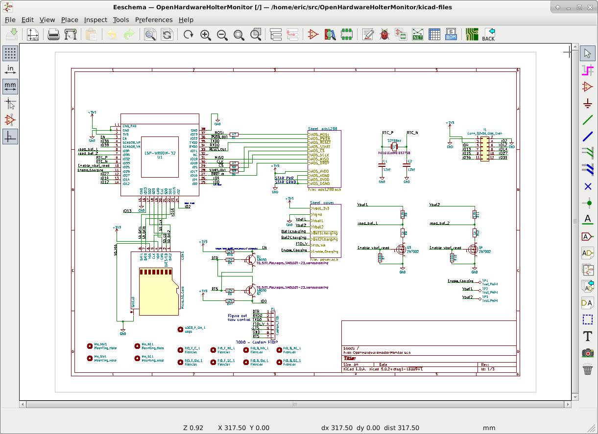

# KICAD PCB
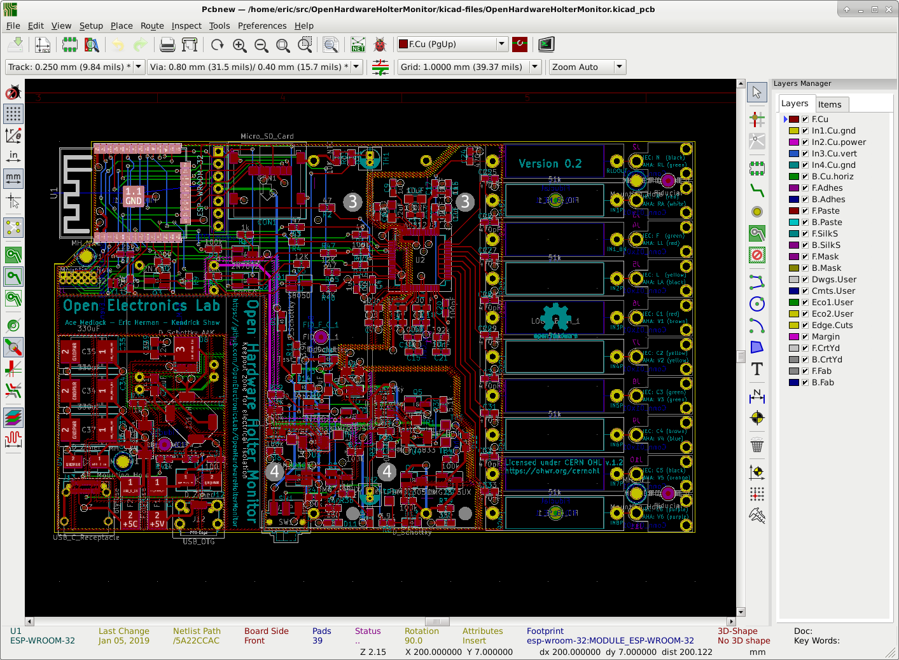

# Populated PCB

# Arduino build environment
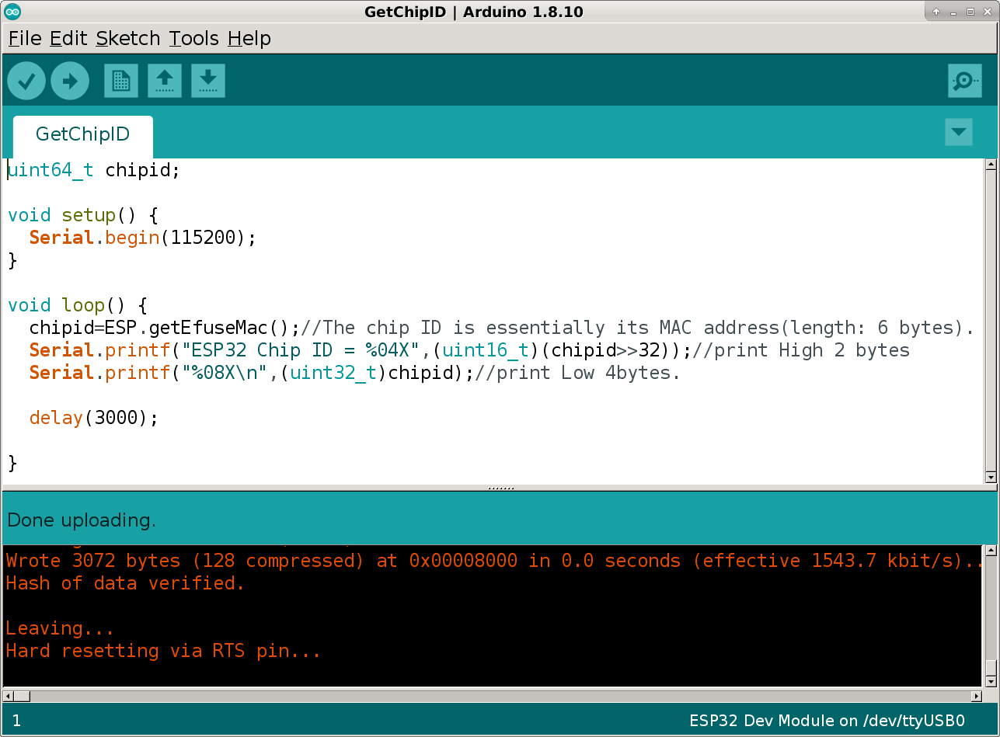

# OpenSCAD
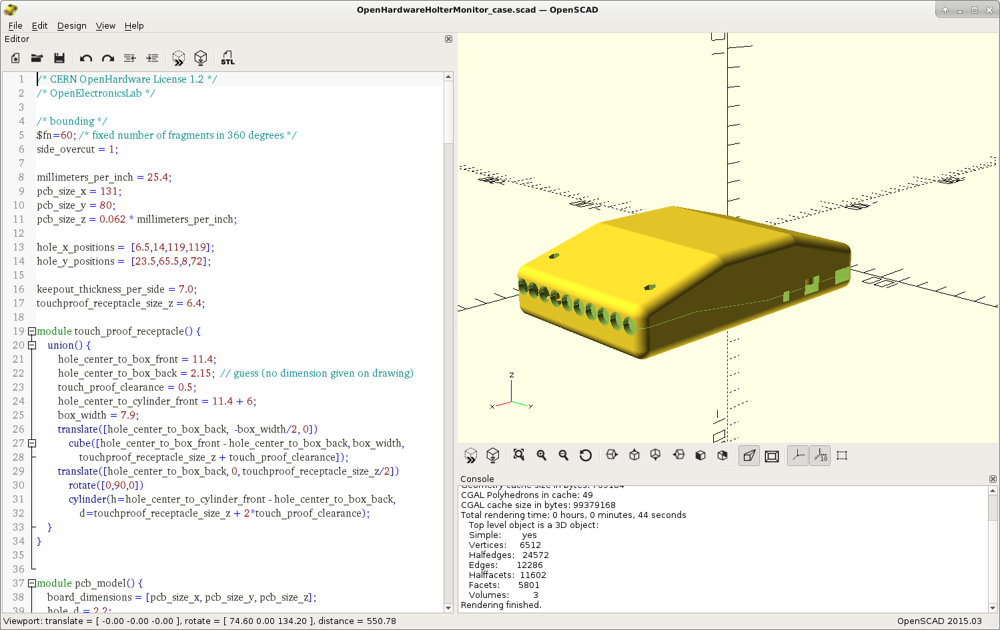

<!-- pass floor to Ace -->
<!--
Learn to Surface mount
hand solder, with one chip
youtube to learn
noise -> should go surface mount
let's just to SMD
Big board with solder paste
issues with solder paste, cold joints
Iron under the scope
- kinda ugly
- purpose is electrical connection, not pretty solder
Makes are still easy to make, but correctable
pix of green wire fixes and descriptions
learned a lot along the way
one of the things was safety
-->
# Learning surface mount soldering

*rev0: through-hole except the chip*
<!-- our first board was through-hole soldered, except the chip. -->

# Learning surface mount soldering
- "Pin sweep" method of soldering ICs
- I learned it by watching YouTube!
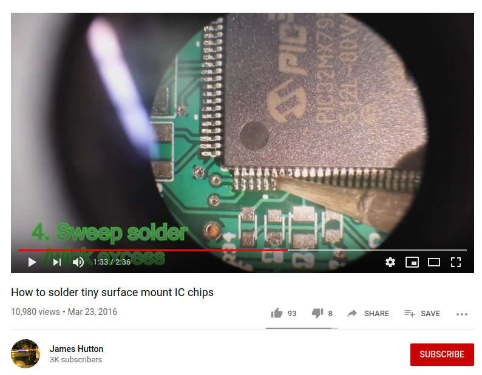
<!-- At first we were intimidated by the tiny feet, but after watching some YouTube videos we were willing to give it a try - and it worked!
We felt like our first board had too much noise for what we wanted to do, so in our second design we focused on reducing noise - and that meant making the leap to all surface-mount components. -->

# Learning surface mount soldering
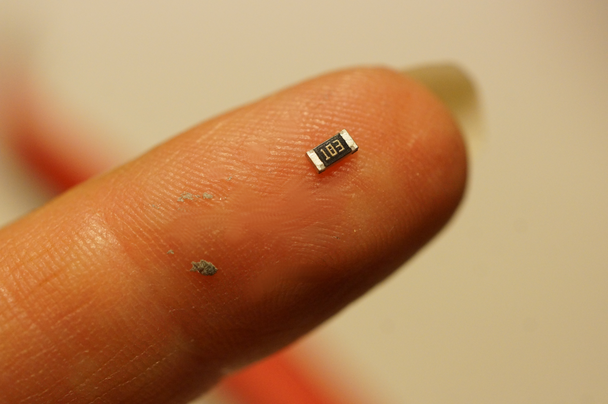
<!-- surface mount components are tiny -->

# Solder paste

*solder paste applied to a board*
<!-- so we thought it would be good to use solder paste a hot air gun. You apply the solder paste using a stencil, you end up with sticky paste just on the pads, and then you stick your component into the paste and heat it up with a hot air gun. Easy! -->

# Solder paste

*surface mount components soldered with solder paste*
<!-- After you apply the hot air gun, you get something like this, which looks fine... Except when we tested the board, it didn't work. We seemed to have a lot of bad solder joints. In trying to find the bad joints, I took the board under the microscope, and then I figured out why... -->

# Solder paste

*Solder paste under the microscope*
<!-- This is what solder paste looks like under the microscope. It's actually a bunch of little beads of solder, held together by paste. -->

# Solder paste

*solder paste joint: OK*
<!-- Some joints look like this - these are OK. -->

# Solder paste

*solder paste joint: cold solder*
<!-- But some look like this. Does this conduct electricity? Maybe. Probably not reliably. I found it really hard to tell which joints were OK. So, new plan: -->

# Soldering using a dissection scope
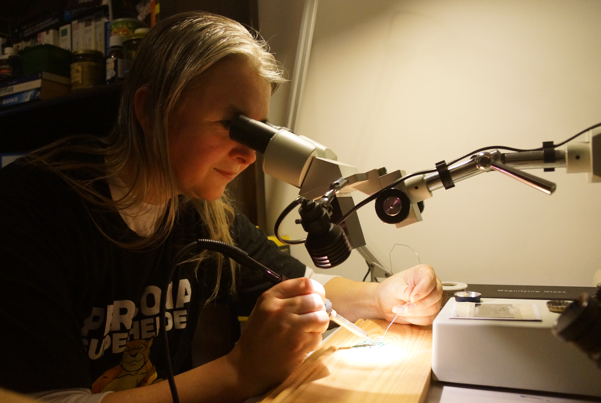
*using a microscope for soldering*
<!-- Use a microscope and hand-solder -->

# Hand-soldering surface mount
- The job of a solder joint is to conduct electricity, not to look pretty
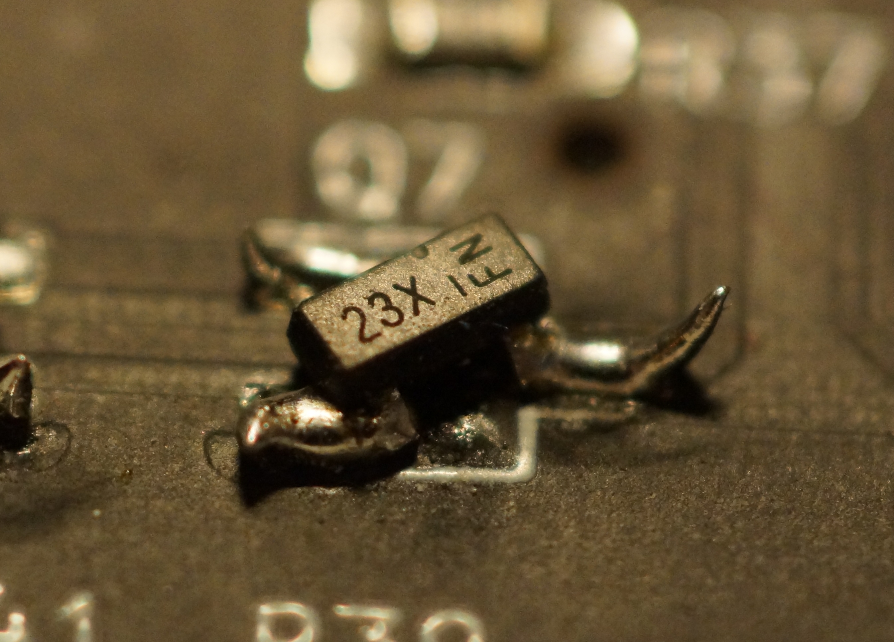
*ugly, but works*
<!-- Using this method does not result in pretty solder joints. But the job of a solder joint is to conduct electricity, not to look pretty. -->

# Hand-soldering surface mount
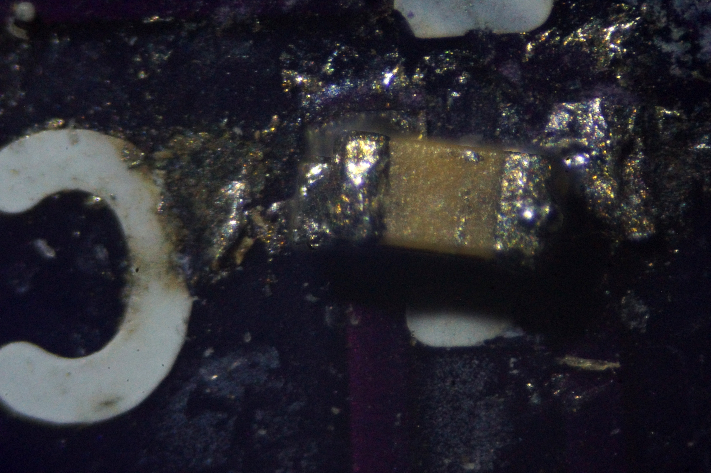
*hand-soldered 0201 capacitor*
<!-- You can even do an 0201 package - I refer to these as breathably small components. -->

# Fixing misteaks
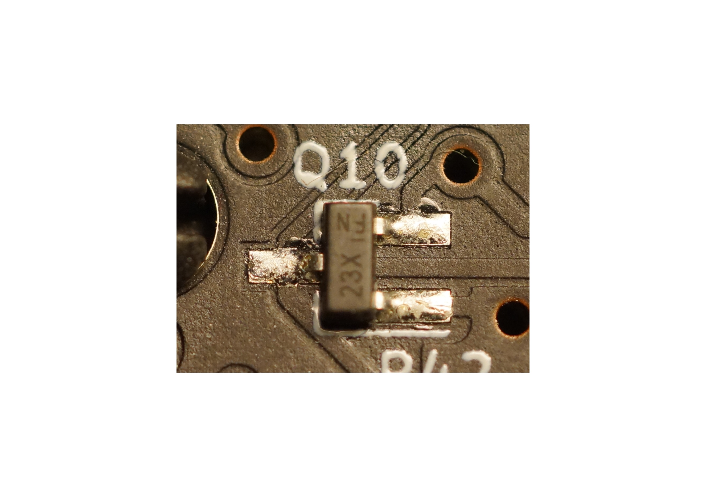
<!-- One thing that is really good about learning to work with surface mount is that you learn that you don't have to be afraid of mistakes. And you will make mistakes - especially if you're working in the evenings and weekends like we do, sometimes with long breaks between. -->

# Fixing misteaks
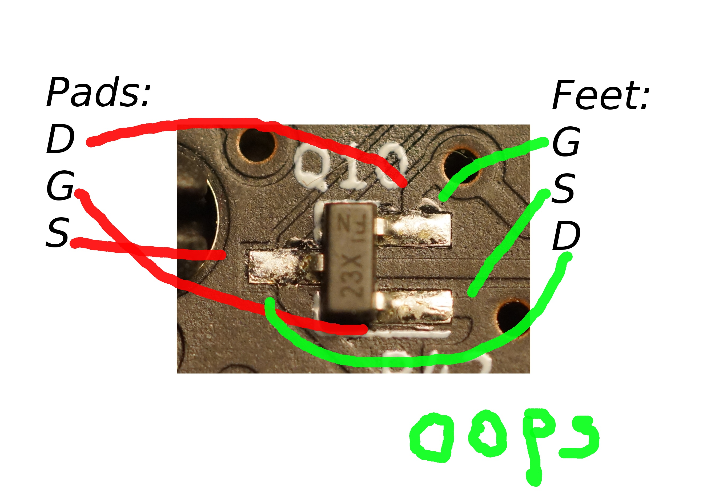
<!-- The problem here was we got the wrong footprint: The pads are DGS, the feet are GSD -->

# Fixing mistakes
- You will make mistakes. You will be able to fix them.
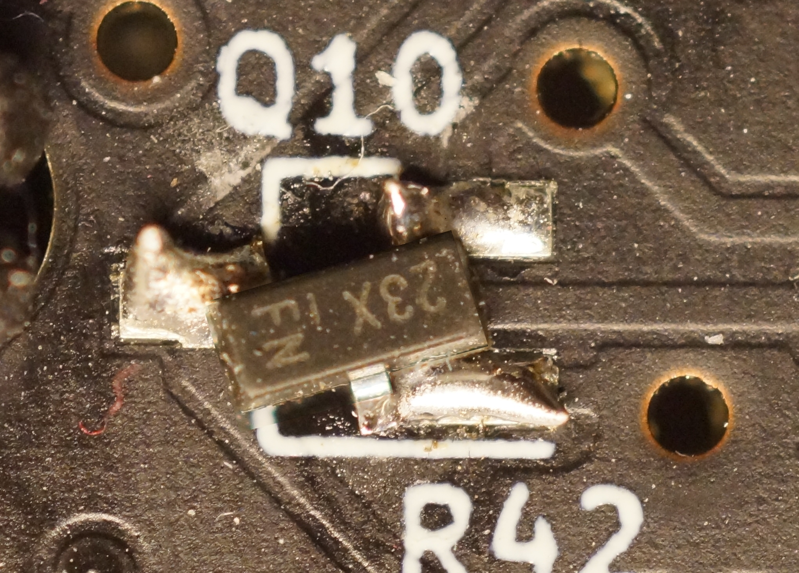
*rotated Q10*
<!-- So we just picked it up, rotated it, and stuck it back down. -->

# Fixing mistakes
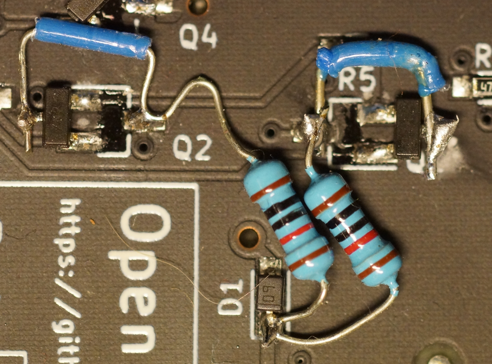
*flipped Q1-Q2*
<!-- But that wasn't the worst error on this board - Q1-Q2 had pin 1 and 2 reversed. This was my solution - turn the component 180 degrees and greenwire pin 3 to its pad. We also needed to add a couple resistors that we forgot. -->

# Fixing mistakes
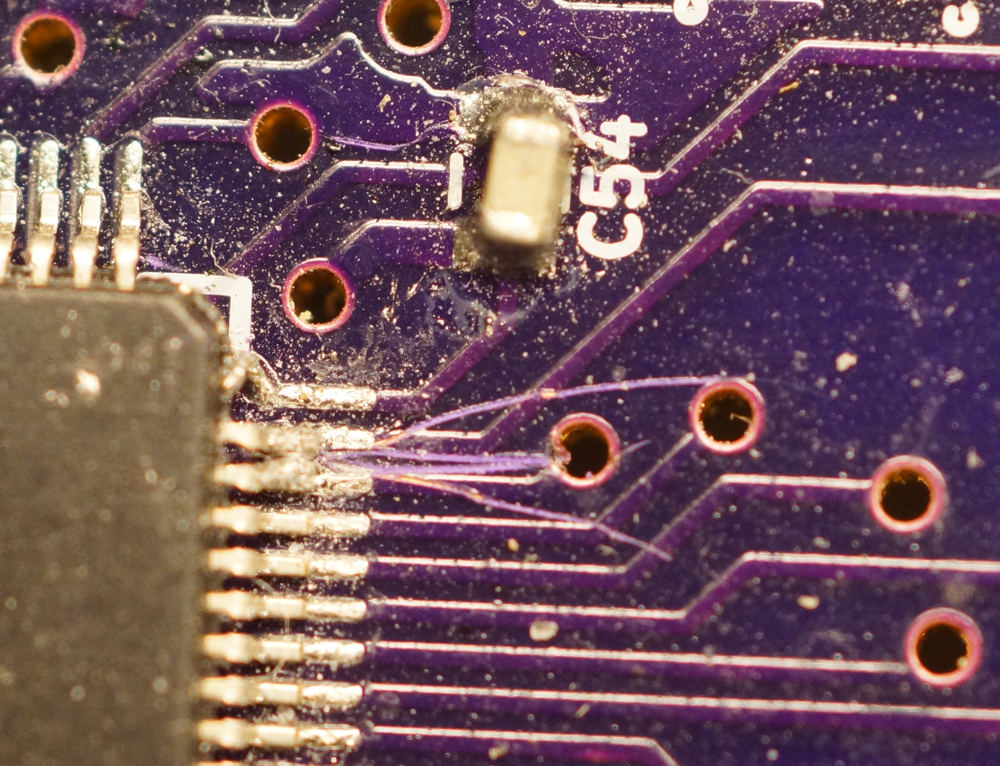
*cut traces*
<!-- So what if you put a trace where you shouldn't have one? Well, you can just get a razor blade and cut it... provided you have a two-layer board. Or you can try lifting the foot of the IC up off the pad... -->

# Fixing mistakes
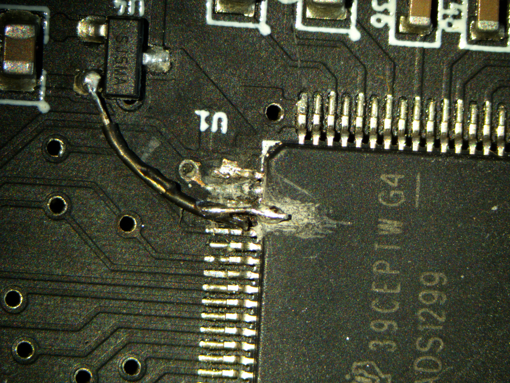
*green wire into the chip*
<!-- And if you accidentally break off the foot while doing that... then you can just dremel into the chip itself, and hook the wire up straight to the chip. This is Kendrick's work, by the way. The problem was that PWRDWN and RESET should have been tied HIGH not LOW. D'oh! (https://github.com/OpenElectronicsLab/OpenHardwareExG_Shield/commit/507f61efbbbc3e7b2749c49335f21cd2c08a47c7)
-->

<!-- May or may not mention Testing:
# testing
- big board was hard to test - getting a working board was hard; we now know 
- we need to build testing into the design for bigger boards but we haven't mastered this skill yet. (Our current board is just smaller, and we didn't hand-solder it :) )
- Picture of testing harness for ExG_Shield? Just a picture of big board?
-->

<!-- end Ace -->

# Safety is important, and often fairly simple
<!--
https://en.wikipedia.org/wiki/Goggles#/media/File:Your_Quota_Two_eyes_that_see_Protect_them_2012_002_7217_xg94hq433_crop.tiff
(public domain from 1955 in USA, originally published without copyright notice)
-->
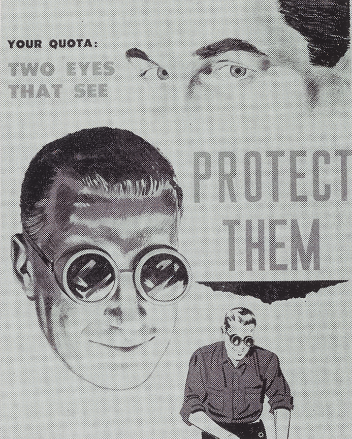

<!-- Ace hands floor to KMS -->

# General concepts
- What could go wrong?
- How serious is it
- How likely is it
- Risk = severity * probability
- Iterate design until risk is acceptable
  - freeclimbing
  <!-- moderate levels of risk more acceptable for yourself -->
  <!-- freeclimbing photo, not safe, but that can be an okay choice -->
  - Sometimes a high level of risk is acceptable
    - e.g. Defibrillator

# Risk of electrical shock
- Small currents can be dangerous when crossing the heart
- Current rather than voltage
    - Pacemaker voltages (~2 volts)
    - Minimum fibrilation currents
    - Resistances can be very low in a medical context
      - central lines, surgery, etc.
<!-- MAYBE Figure with patient and heart in circuit -->

# Isolation
- Batteries (Safety Extra Low Voltage, or SELV)
    - e.g.: unplugged laptop
- Creepage and clearance
  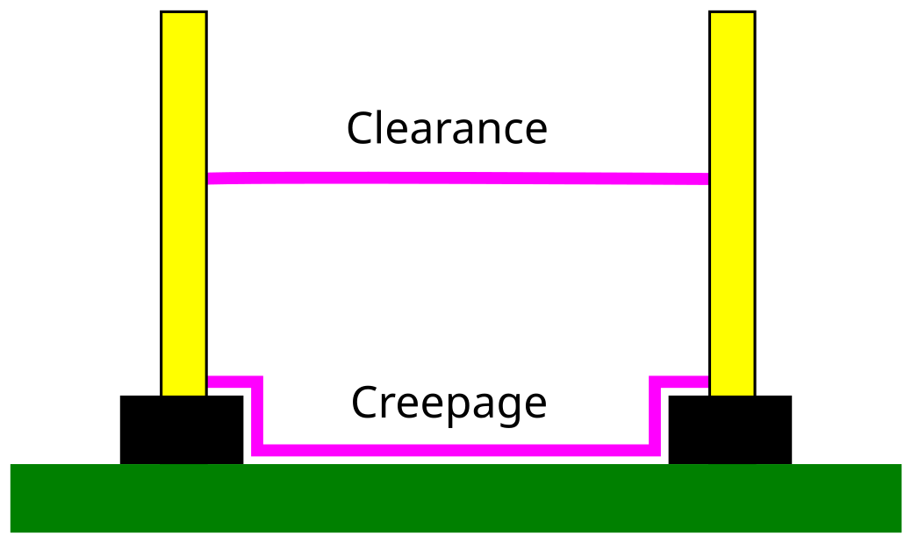
- Power isolation
- Data isolation

# Leakage current standards

--------------------------------------------------------------------
Leakage Current    Body            Body Floating   Cardiac Floating
----------------- --------------- --------------- ------------------
Earth              500 $\mu$A      500 $\mu$A       500 $\mu$A

Enclosure          100 $\mu$A      100 $\mu$A       100 $\mu$A

Patient            100 $\mu$A      100 $\mu$A        10 $\mu$A
--------------------------------------------------------------------

- Can only be 2-5 times larger even if component fails
<!-- MAYBE Isolated, body float, cardiac float symbols -->

# Designing for failures
- Safe if any one component fails
- 2 means of patient protection
    - two layers of basic isolation
      vs. reinforced isolation
- Current limiting resistors on patient connections

# Take home message
- a little thought about safety goes a long way
- great tools and resources to support you
- don't be too intimidated
	- try
	- repeat
	- you'll improve as you go
- happy hardware hacking!

# References and Contacts

- Books and references
     - The Art of Electronics, Horowitz and Hill
     - Medical Instrumentation Aplication and Design, Webster
     - Texas Lude Man: https://www.youtube.com/watch?v=eg2hxpy--gg

- Contact
    - github
    - email addresses
